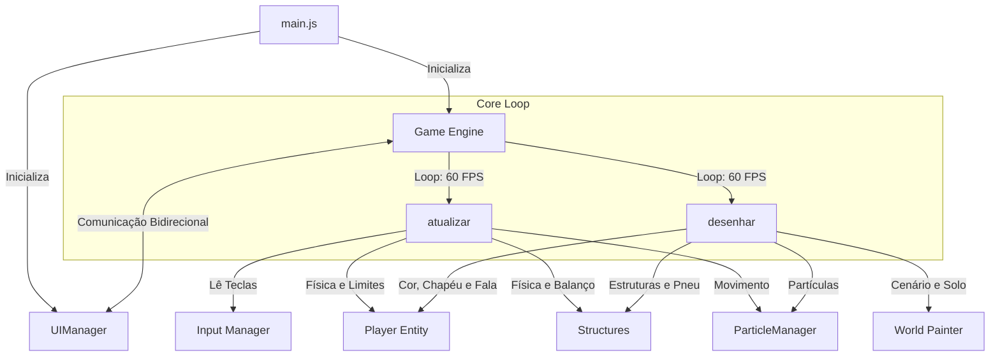

# 🏡 Jabuli World

Bem-vindo ao **Jabuli World**, um jogo cozy e relaxante construído em JavaScript utilizando renderização em Canvas 2D e interface DOM, agora empacotado e otimizado com **Vite**.

Este repositório foi reestruturado seguindo padrões de arquitetura de desenvolvimento de jogos (Gamedev), dividindo o monólito original de 35KB em módulos e sistemas bem delimitados.

---

## 📐 Arquitetura do Jogo (Gamedev Engine)

O fluxo principal do jogo opera sob um loop contínuo que separa a atualização física de estado (`update`) da renderização visual na tela (`draw`).



---

## 🗂️ Estrutura do Repositório

```text
jabuliword/
├── dist/                        # Build otimizado gerado para produção (Cloud)
├── node_modules/                # Dependências instaladas pelo NPM
├── src/                         # Código fonte do jogo
│   ├── engine/
│   │   ├── Game.js              # Loop principal, controle de fluxo e colisões
│   │   ├── Input.js             # Captura de teclado isolada e limpa
│   │   └── ParticleManager.js   # Sistema de partículas flutuantes do ambiente
│   ├── entities/
│   │   ├── Player.js            # Lógica, customizações e desenho do Jabuli
│   │   └── Structure.js         # Edifícios interativos, balanço de pneu e físicas
│   ├── ui/
│   │   └── UIManager.js         # Painel DOM, abas, compras, preview e arrastar caixas
│   ├── world/
│   │   └── World.js             # Renderização de mapas, solos, gramados e decorações
│   ├── constants.js             # Constantes, registros de mapas e chaves físicas de brinquedos
│   └── style.css                # Estilização visual cozy das janelas, abas e HUD
├── .gitignore                   # Ignora pastas de build e dependências no Git
├── index.html                   # Entry point estrutural carregado pelo Vite
├── package.json                 # Manifesto de scripts e dependências do Node.js
└── rodar.bat                    # Script em um clique para inicialização local rápida
```

---

## 🚀 Como Executar

### Pré-requisitos
* Ter o **Node.js** instalado na sua máquina.

### Executando Localmente (Development Server)
1. Dê dois cliques em **`rodar.bat`** (ou execute `npm run dev` no seu terminal).
2. O Vite iniciará o servidor e o jogo estará disponível em `http://localhost:5173/`.
3. O Hot Module Replacement (HMR) está ativo: qualquer alteração salva nos arquivos atualiza o jogo no seu navegador em tempo real!

### Gerando o Build para a Cloud (Production Build)
Para gerar uma build otimizada e minificada para subir na nuvem (Vercel, Netlify, Cloudflare Pages):
```bash
npm run build
```
Isso gerará a pasta **`dist/`** otimizada no seu diretório. Esta pasta é a única necessária para colocar o jogo no ar em produção.

Para testar o build de produção localmente antes de fazer o deploy, use:
```bash
npm run preview
```

---

## 🛠️ Padrões de Gamedev Aplicados

* **Game Loop Separado**: A classe principal `Game` roda sob o ciclo do navegador de `requestAnimationFrame`.
* **State & Rendering Separation (`update` vs `draw`)**: 
  * O método `update()` atualiza coordenadas, processa inputs do jogador e testa colisões físicas.
  * O método `draw()` apenas pinta os elementos no Canvas com base no estado calculado, sem realizar lógica de movimentação.
* **Input Interceptor**: O teclado (`Input.js`) monitora as teclas pressionadas de forma genérica e ignora cliques se o jogador estiver focado na caixa de chat ou de inserção de código.
* **Componentização de UI**: A interface HTML/CSS (DOM) é totalmente independente do canvas do jogo. O `UIManager` gerencia as transições, permitindo adicionar novos menus e pop-ups sem poluir os loops lógicos de desenho do canvas.

---

## 🔮 Como Expandir o Escopo do Jogo

O jogo foi estruturado especificamente para que você consiga escalá-lo de forma limpa:

### 1. Adicionar Novos Mapas
Vá em `src/constants.js` e insira uma nova chave no objeto `configuracaoMapas`:
```javascript
"jardim_de_inverno": { 
    solo: "#d8f3dc", 
    grama: "#95d5b2", 
    nome: "Vale Congelado" 
}
```
Depois, adicione um botão de visita correspondente em `index.html` chamando a função global `irParaMapa('jardim_de_inverno')`.

### 2. Adicionar Novos Chapéus e Cosméticos
Adicione o chapéu como item no `inventario` inicial dentro de `UIManager.js` e insira sua lógica geométrica de desenho dentro da função exportada `renderizarChapeuGenerico` em `src/entities/Player.js`.

### 3. Adicionar Novas Estruturas Interativas
Para incluir novos elementos no cenário (ex: uma fonte que recupera energia, ou um portal de minigame):
1. Instancie uma nova classe `Structure` na lista em `src/entities/Structure.js`.
2. Adicione sua representação visual sob uma condição no método `draw()` da classe `Structure`.
3. Implemente a ação física de colisão dentro do método `atualizar()` em `Game.js`.
